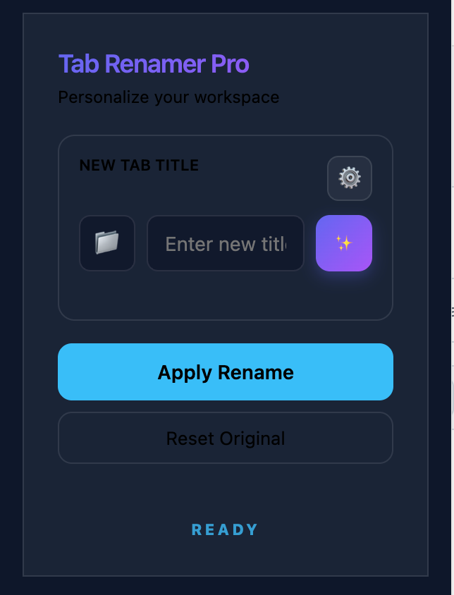

# Tab Renamer Pro 🚀

A premium, minimalist browser extension for intelligent tab management. Personalize your workspace with AI-powered suggestions and persistent custom titles.

## ✨ Features

- **🤖 Multi-AI Support**: Integrated with Google Gemini, OpenAI GPT-4o, Anthropic Claude, and OpenRouter (DeepSeek/Llama).
- **🌗 Dual Themes**: Pure Minimalist Light and Deep Dark modes with a persistent toggle.
- **📁 Emoji Picker**: A curated set of high-quality emojis to organize your tabs visually.
- **💾 Persistence**: Custom titles stay active even after page refreshes or browser restarts.
- **⚡ Advanced UX**: 
  - Smooth "Mobile-App" style sliding navigation for settings.
  - Auto-close on manual rename completion.
  - Instant reset to the original page title.
- **⌨️ Keyboard Shortcut**: Quickly open the renamer with `Cmd/Ctrl + Shift + Y`.

## 🚀 Installation

1.  Clone this repository or download the ZIP.
2.  Open Chrome and navigate to `chrome://extensions/`.
3.  Enable **Developer Mode** in the top right.
4.  Click **Load unpacked** and select the extension folder.

## 🛠️ Configuration

1.  Open the extension settings (Cog icon).
2.  Navigate to **AI Configuration**.
3.  Select your preferred provider and paste your API Key.
4.  Your key is stored securely in your browser's local sync storage.

## 🛡️ Privacy & Security

- **Direct Communication**: All AI requests are made directly from your browser to the providers. No middle-man servers.
- **Local Storage**: API keys and custom titles are stored only in your browser/Google account profile.

---

[中文文档 (Chinese)](README_CN.md)
